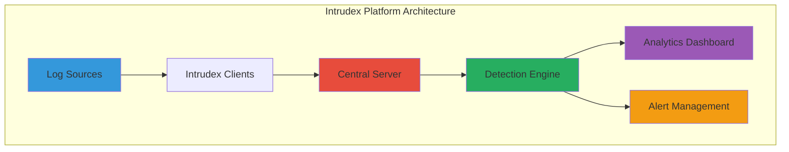

# About Intrudex

**Intrudex** is a comprehensive, open-source security monitoring and threat detection platform designed to provide enterprise-grade security intelligence for organizations of all sizes. Built with modern technologies and designed for scalability, Intrudex delivers real-time threat detection, log analysis, and security monitoring capabilities.

---

## Mission Statement

Our mission is to democratize enterprise-grade security monitoring by providing an open-source platform that delivers professional-level threat detection capabilities without the complexity and cost barriers typically associated with commercial solutions.

---

## What is Intrudex?

Intrudex is a distributed security monitoring system that combines:

- **Real-time Log Collection**: Advanced log aggregation from multiple sources
- **Threat Detection Engine**: Sigma-based rules processing and behavioral analysis
- **Security Analytics**: Comprehensive analysis and correlation of security events
- **Scalable Architecture**: Designed to grow with your organization's needs
- **Enterprise Integration**: Seamless integration with existing security infrastructure

---

## Platform Architecture

### Client-Server Model

Intrudex operates on a distributed client-server architecture:

**Intrudex Clients**:
- Lightweight agents deployed on monitored systems
- Real-time log collection and preprocessing
- Local threat detection capabilities
- Secure communication with central server

**Intrudex Server**:
- Central management and coordination
- Advanced analytics and correlation engine
- Web-based dashboard and management interface
- API endpoints for integrations

### Technology Stack

#### Backend Technologies
- **Language**: `Python 3.10+`
- **Framework**: `Flask`
- **Database**: `PostgreSQL`, `SQLite`

#### Frontend Technologies
- **Framework**:  `Flask` / `Jinja Templates` / `MKDocs`
- **Styling**: `Tailwind CSS` / `CSS`
- **Visualization**: `Clipboard.js` / `Chart.js` / `CodeMirror` / `Mermaid`
- **Real-time Updates**: HTMX / Alpine.js 
- **Miscellaneous**: `Prism` / `Font Awsome` / `jsDelivery` / `Google Fonts API` / `UnPkg`

#### Client Technologies
- **Language**: `C++`
- **Platform Support**: `Windows`
- **Service Integration**: `Windows Services`
- **Configuration**: `JSON` and `XML` based configuration

---

## Licensing & Legal

### Open Source License
Intrudex is released under the **MIT License**, ensuring:

- **Freedom to Use**: Commercial and non-commercial use
- **Freedom to Modify**: Adapt to your specific needs
- **Freedom to Distribute**: Share with your organization
- **No Warranty**: Use at your own risk with community support

### Trademark Information

- **Intrudex™**: Trademark of ToolsHive
- **Usage Guidelines**: Proper attribution required
- **Commercial Use**: Permitted under license terms

---

## About the Developer

### [Armoghan-ul-Mohmin](https://armoghan.netlify.app)
**Lead Developer & Project Founder**

Armoghan-ul-Mohmin is a passionate security researcher and software engineer dedicated to making enterprise-grade security tools accessible to organizations worldwide. With extensive experience in cybersecurity and software development, he leads the Intrudex project with a vision of democratizing security monitoring.

#### Connect with the Developer
- **LinkedIn**: [Armoghan-ul-Mohmin](https://www.linkedin.com/in/armoghan-ul-mohmin-4289a9248)
- **Github**: [Armoghan-ul-Mohmin](https://github.com/Armoghan-ul-Mohmin) 
- **Website**: [Armoghan.netlify.app](https://Armoghan.netlify.app)
- **Email**: [Armoghan@proton.me](Armoghan@proton.me)

#### Expertise Areas
- **Cybersecurity**: Threat detection, incident response, security architecture
- **Software Development**: Full-stack development, system architecture
- **Security Research**: Vulnerability research, security tool development
- **Data Analysis**: Security analytics, machine learning applications

---

## Project Information

### Current Status
- **Version**: 1.0.0
- **Release Date**: 2025
- **Development Status**: Active development
- **Community**: Growing user and contributor base

### Resources
- **Official Repository**: [GitHub.com/ToolsHive/Intrudex](https://github.com/ToolsHive/Intrudex)
- **Documentation**: [Intrudex Documentation](https://toolshive.github.io/Intrudex/)
- **Bug Reports**: [GitHub Issues](https://github.com/ToolsHive/Intrudex/issues)
- **Community Discussion**: [GitHub Discussions](https://github.com/ToolsHive/Intrudex/discussions)

---