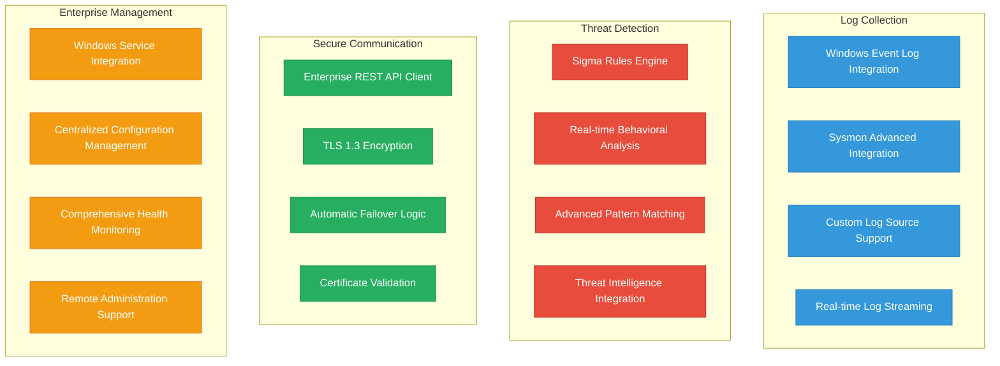
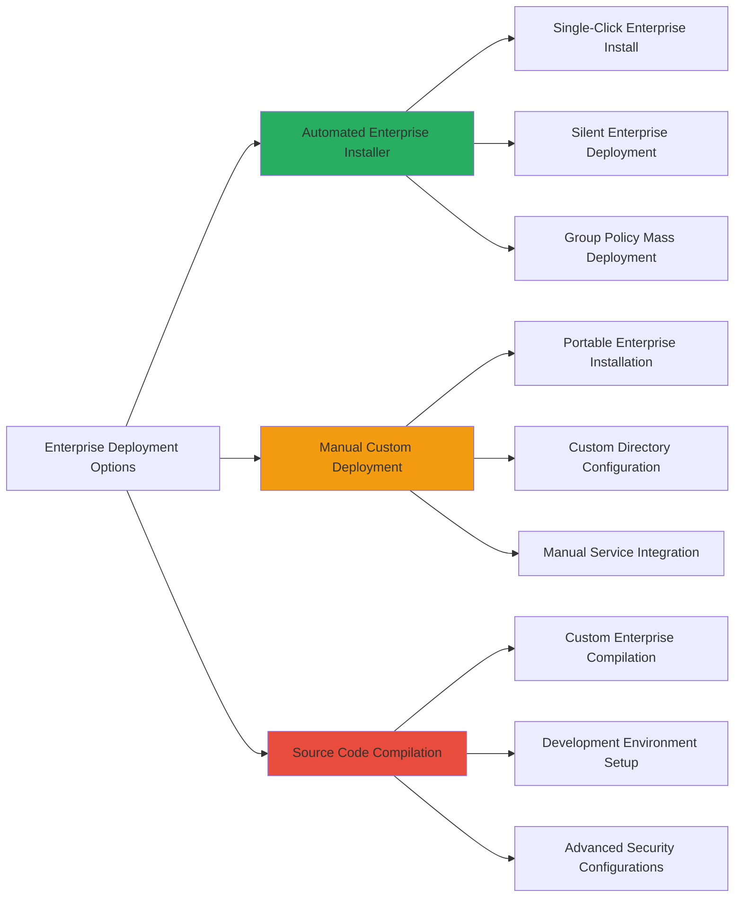
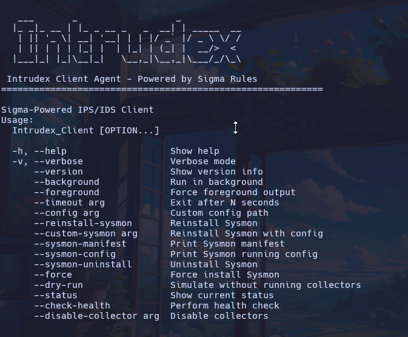

# Intrudex Client Installation Guide

The Intrudex Client is a sophisticated, lightweight, high-performance C++ security service specifically engineered for continuous enterprise security monitoring across Windows endpoint infrastructures.

---

## Client Architecture Overview

!!! info "Enterprise Client Capabilities"
    The Intrudex Client provides real-time log analysis capabilities, implements Sigma rule-based threat detection methodologies, and ensures seamless integration with centralized management infrastructure while maintaining minimal system resource utilization.

### Enterprise Client Capabilities Matrix

---

## System Requirements

### Minimum Technical Specifications
- **Operating System**: Windows 10 (Build 1809 or later) / Windows Server 2016 or subsequent versions
- **Memory Allocation**: 100 MB RAM (typical operational usage)
- **Storage Requirements**: 50 MB available disk space
- **Network Connectivity**: Secure HTTPS connectivity to Intrudex Server infrastructure
- **Administrative Privileges**: Elevated rights required for installation and service management operations

### Enterprise Platform Support Matrix

=== "Windows 10/11 Professional"
    - Professional, Enterprise, and Education editions fully supported
    - Home edition supported with feature limitations

=== "Windows Server Infrastructure"
    - Windows Server 2016, 2019, 2022 fully certified
    - Windows Server Core deployments officially supported

!!! warning "Platform Compatibility Notice"
    The Intrudex Client is exclusively architected for Windows platform environments. Unix-based systems (Linux, macOS) are not supported for client deployment.

---

## Installation Methods

Choose the deployment methodology that optimally aligns with your organizational security requirements:

### Method Comparison

| Feature | [Automated Installer](windows-installer.md) | [Portable Deployment](windows-portable.md) | [Source Compilation](windows-source.md) |
|---------|-----|-----|-----|
| **Ease of Use** | ⭐⭐⭐⭐⭐ | ⭐⭐⭐ | ⭐⭐ |
| **Customization** | ⭐⭐ | ⭐⭐⭐⭐ | ⭐⭐⭐⭐⭐ |
| **Enterprise Ready** | ⭐⭐⭐⭐⭐ | ⭐⭐⭐⭐ | ⭐⭐⭐ |
| **Security Audit** | ⭐⭐⭐ | ⭐⭐⭐⭐ | ⭐⭐⭐⭐⭐ |
| **Mass Deployment** | ⭐⭐⭐⭐⭐ | ⭐⭐⭐ | ⭐⭐ |

---

## Installation Methods

-   :fontawesome-solid-download:{ .lg .middle } **Automated Installer**

    ---

    **Recommended for Production Environments**
    
    Streamlined deployment with comprehensive system integration
    
    - Windows Service registration
    - Security policy configuration
    - Silent installation support
    - Group Policy deployment

    **[Install with Automated Installer →](windows-installer.md)**

-   :fontawesome-solid-file-zipper:{ .lg .middle } **Portable Deployment**

    ---

    **Advanced Configuration Management**
    
    Ideal for custom installation paths and advanced configuration
    
    - Custom directory installation
    - Manual configuration control
    - Portable executable
    - Service registration options

    **[Deploy Portable Version →](windows-portable.md)**

-   :fontawesome-solid-code:{ .lg .middle } **Source Compilation**

    ---

    **Advanced Enterprise Users**
    
    For organizations requiring source code auditing and custom modifications
    
    - Complete source code access
    - Custom build configurations
    - Development environment
    - Advanced security options

    **[Build from Source →](windows-source.md)**

---

## Command Line Interface

The Intrudex Client provides an extensive command-line interface for enterprise deployment and management:

### Core Operations

| Parameter | Short Form | Description | Usage Example |
|-----------|------------|-------------|---------------|
| `--help` | `-h` | Display comprehensive help information | `intrudex-client.exe -h` |
| `--version` | | Show version and build information | `intrudex-client.exe --version` |
| `--verbose` | `-v` | Enable detailed logging output | `intrudex-client.exe -v` |
| `--config <path>` | | Specify custom configuration file location | `intrudex-client.exe --config "C:\config\custom.json"` |
| `--background` | | Execute as background service (default) | `intrudex-client.exe --background` |
| `--foreground` | | Run in foreground for debugging | `intrudex-client.exe --foreground` |
| `--status` | | Display current operational status | `intrudex-client.exe --status` |
| `--check-health` | | Perform comprehensive system health check | `intrudex-client.exe --check-health` |

### Sysmon Integration

| Parameter | Description | Usage Example |
|-----------|-------------|---------------|
| `--reinstall-sysmon` | Reinstall Sysmon with default configuration | `intrudex-client.exe --reinstall-sysmon` |
| `--custom-sysmon <path>` | Deploy Sysmon with custom configuration | `intrudex-client.exe --custom-sysmon "C:\configs\sysmon.xml"` |
| `--sysmon-config` | Show active Sysmon configuration | `intrudex-client.exe --sysmon-config` |
| `--sysmon-uninstall` | Remove Sysmon installation | `intrudex-client.exe --sysmon-uninstall` |

### Collector Management

| Parameter | Description | Usage Example |
|-----------|-------------|---------------|
| `--disable-collector <name>` | Disable specific log collector | `intrudex-client.exe --disable-collector sysmon` |

Available collectors: `sysmon`, `security`, `system`, `application`

---