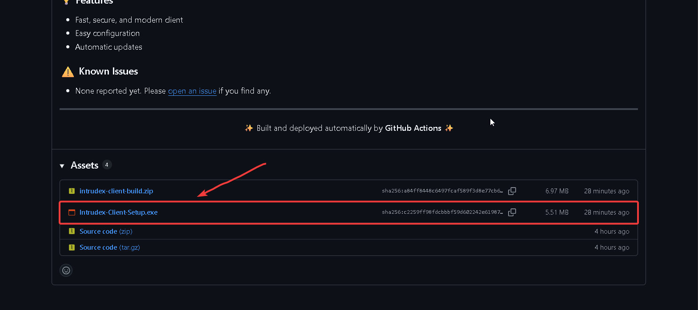
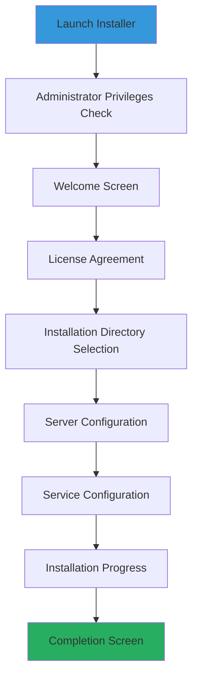

# Automated Installer Deployment

The automated enterprise installer provides the most streamlined deployment experience with comprehensive system integration capabilities, making it the recommended method for production environments.

---

## Installer Overview

!!! info "Enterprise Installer Features"
    The `Intrudex-Client-Setup.exe` installer provides complete automation for enterprise deployments with built-in security configurations, service registration, and mass deployment capabilities.

### Key Features

- **Automated Dependency Resolution**: Automatically handles all required dependencies
- **Windows Service Registration**: Configures and registers the client as a Windows service
- **Enterprise Security Configuration**: Applies enterprise security policies automatically
- **Registry Integration**: Proper registry entries for system integration
- **Silent Installation Support**: Command-line options for mass deployment
- **Comprehensive Uninstallation**: Complete removal capability when needed

---

## System Requirements

### Minimum Technical Specifications
- **Operating System**: Windows 10 Build 1809+ / Windows Server 2016+
- **Memory**: 100 MB RAM available
- **Storage**: 50 MB free disk space
- **Network**: HTTPS connectivity to Intrudex Server
- **Privileges**: Administrative rights required

### Enterprise Environment Prerequisites
- **Group Policy**: Configure software installation policies (if applicable)
- **Antivirus Exclusions**: Add Intrudex installation directory to exclusions
- **Certificate Validation**: Verify digital signature validation is enabled
- **Network Access**: Ensure access to GitHub releases and Intrudex Server

---

## Installation Process

### Step 1: Installer Acquisition

Download the latest enterprise installer from the official repository:

1. **Navigate** to [GitHub Releases](https://github.com/ToolsHive/Intrudex/releases)
2. **Locate** the latest stable release
3. **Download** `Intrudex-Client-Setup.exe`

4. **Verify** digital signature (recommended for security compliance)

### Step 2: Digital Signature Verification

!!! warning "Security Best Practice"
    Always verify the digital signature before executing the installer in production environments.

=== "Windows GUI Method"
    1. Right-click `Intrudex-Client-Setup.exe`
    2. Select **Properties**
    3. Navigate to **Digital Signatures** tab
    4. Verify the signature is valid and from trusted publisher

=== "PowerShell Method"
    ```powershell
    # Verify digital signature
    Get-AuthenticodeSignature -FilePath "Intrudex-Client-Setup.exe"
    
    # Expected output should show:
    # Status: Valid
    # SignerCertificate: [Certificate details]
    ```

### Step 3: Interactive Installation

For standard desktop deployments with user interaction:

1. **Execute** `Intrudex-Client-Setup.exe` with administrative privileges
2. **Follow** the installation wizard prompts
3. **Configure** server connection settings when prompted
4. **Complete** the installation process

#### Installation Wizard Steps


---

## Post-Installation Verification

### Service Verification

Verify the Intrudex Client service is properly installed and running:

```powershell
# Check service status
Get-Service -Name "IntrudexClient"

# Expected output:
# Status: Running
# Name: IntrudexClient
# DisplayName: Intrudex Security Monitoring Client

# View service configuration
sc query IntrudexClient
sc qc IntrudexClient
```

### Installation Verification

Verify the client installation and configuration:

```cmd
# Navigate to installation directory
cd "C:\Program Files\Intrudex"

# Check client status
intrudex-client.exe --status

# Perform health check
intrudex-client.exe --check-health

# View version information
intrudex-client.exe --version
```

### Network Connectivity Test

Verify connectivity to the Intrudex Server:

```powershell
# Test HTTPS connectivity to server
Test-NetConnection -ComputerName "your-server.domain.com" -Port 80

# Verify API endpoint accessibility
Invoke-WebRequest -Uri "https://your-server.domain.com/api -UseBasicParsing
```

---

## Configuration

### Server Connection Configuration

After installation, configure the connection to your Intrudex Server:

1. **Navigate** to the installation directory
2. **Edit** `config\client_config.json`
3. **Configure** server connection parameters:

```json
{
  "sysmon_exe_path": "assets/Sysmon64.exe",
  "sysmon_config_path": "config/sysmonconfig-export.xml",
  "sysmon_url": "http://your-server.domain.com/api/logs/sysmon/",
  "application_url": "https://your-server.domain.com/api/logs/application",
  "security_url": "http://your-server.domain.com/api/logs/security",
  "system_url": "http://your-server.domain.com/api/logs/system",
  "system_event_log_source": "System",
  "application_log_source": "Application",
  "security_event_log_source": "Security",
  "event_log_source": "Microsoft-Windows-Sysmon/Operational",
  "event_filter": "*[System[(Level=4 or Level=0)]]",
  "sleep_interval_ms": 1000,
  "log_level": "debug",
  "send_events": true,

  "http_config": {
    "user_agent": "Intrudex Client/1.0",
    "content_type": "application/xml",
    "use_https": false
  },
  "default_flag": "background",
  "sigma_url": "http://your-server.domain.com/api/logs/sigma",
  "sigma_event_log_source": "Security",
  "sigma_event_filter": "*[System[(Level=4 or Level=0)]]",
  "sigma_sleep_interval_ms": 1000,
  "sigma_log_level": "info",
  "sigma_rules_dir": "rules/sigma/",
  "sigma_config_path": "config/sigma_config.json"
}

```
4. Create and Edit  `config\sigma_config.json`

``` json

{
  "api_base_url": "http://localhost/sigma/api",
  "headers": {
    "X-API-Key": "<Your-API-KEY>",
    "Authorization": "<Your-API-KEY>",
    "Accept": "application/json"
  }
}


```

### Service Configuration

Configure the Windows service parameters:

```powershell
# Set service to start automatically
sc config IntrudexClient start=auto

# Set service recovery options
sc failure IntrudexClient reset=86400 actions=restart/5000/restart/5000/restart/5000

# Set service description
sc description IntrudexClient "Intrudex Enterprise Security Monitoring Client Agent"
```

---

## Troubleshooting

### Common Installation Issues

!!! failure "Installer Won't Start"
    **Symptom**: Double-clicking installer shows no response
    
    **Resolution**:
    1. Verify administrative privileges
    2. Check Windows Event Logs for errors
    3. Disable antivirus temporarily during installation
    4. Verify installer file integrity

!!! failure "Installation Fails with Error Code"
    **Symptom**: Installation terminates with error code
    
    **Resolution**:
    1. Run installer with `/LOG="C:\temp\install.log"` parameter
    2. Review installation log for specific errors
    3. Ensure sufficient disk space available
    4. Verify Windows Installer service is running

!!! failure "Service Won't Start After Installation"
    **Symptom**: Intrudex Client service fails to start
    
    **Resolution**:
    1. Check Windows Event Logs for service errors
    2. Verify configuration file syntax
    3. Test network connectivity to server
    4. Ensure proper file permissions on installation directory

---

## Uninstallation

### Standard Uninstallation

Remove the Intrudex Client using standard Windows methods:

1. **Open** Control Panel → Programs and Features
2. **Locate** "Intrudex Client" in the program list
3. **Select** and click "Uninstall"
4. **Follow** the uninstallation wizard prompts

### Silent Uninstallation

For automated uninstallation in enterprise environments:

```powershell
# Find uninstall string from registry
$UninstallPath = Get-ItemProperty "HKLM:\SOFTWARE\Microsoft\Windows\CurrentVersion\Uninstall\*" | 
    Where-Object {$_.DisplayName -like "*Intrudex*"} | 
    Select-Object -ExpandProperty UninstallString

# Execute silent uninstallation
Start-Process -FilePath $UninstallPath -ArgumentList "/S" -Wait
```

### Manual Cleanup (If Required)

If standard uninstallation fails, perform manual cleanup:

```powershell
# Stop service
Stop-Service -Name "Intrudex-Client" -Force

# Remove service
sc delete Intrudex-Client

# Remove installation directory
Remove-Item -Path "C:\Program Files\Intrudex" -Recurse -Force

# Clean registry entries
Remove-Item -Path "HKLM:\SOFTWARE\Intrudex" -Recurse -Force
```

---