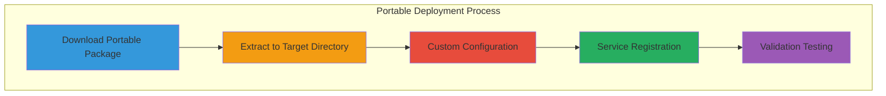
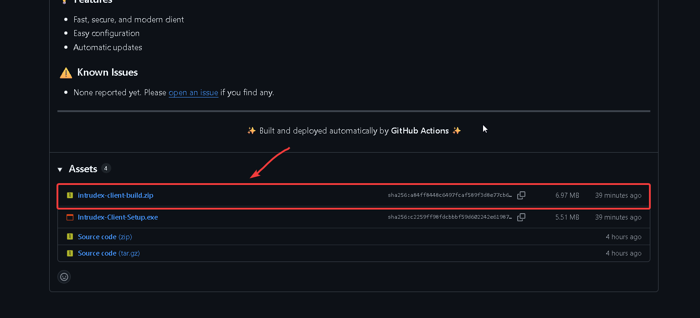

# Portable Deployment

This guide provides instructions for deploying the Intrudex Client using the portable deployment method, which offers maximum flexibility for custom installation paths, advanced configuration management, and specialized enterprise requirements.

---

## Portable Deployment Overview

!!! info "Portable Deployment Features"
    The portable deployment method provides complete control over installation paths, configuration management, and service integration, making it ideal for organizations with specific security policies or custom directory structures.

### Portable Deployment Benefits

- **Custom Installation Paths**: Deploy to any directory structure
- **Manual Configuration Control**: Full control over all configuration parameters
- **No Registry Dependencies**: Minimal system footprint
- **Portable Execution**: Run from removable media or network shares
- **Service Integration Options**: Choose how to integrate with Windows services
- **Advanced Security Configuration**: Custom security policies and permissions



---

## System Requirements

### Minimum Specifications
- **Operating System**: Windows 10 (Build 1809+) / Windows Server 2016+
- **Memory**: 100 MB RAM available
- **Storage**: 100 MB free disk space (including logs and configuration)
- **Network**: HTTPS connectivity to Intrudex Server
- **Permissions**: Administrative privileges for service registration

### Advanced Requirements
- **PowerShell**: Version 5.1 or later (for advanced scripting)
- **Windows Management Framework**: 5.1 or later
- **Microsoft Visual C++ Redistributable**: 2019 or later

---

## Download and Extraction

### Step 1: Download Portable Package

Download the latest portable package from the official repository:



### Step 2: Extract to Target Directory

Extract the portable package to your desired location:
### Extract the Portable Package
=== "Windows (PowerShell)"

    ```powershell
    # Define target directory
    $TargetDirectory = "C:\Intrudex/Intrudex-Client"
    $ZipPath = "Downloads\Intrudex\Intrudex-Client.zip"

    # Create target directory if it doesn't exist
    if (-not (Test-Path $TargetDirectory)) {
        New-Item -ItemType Directory -Path $TargetDirectory -Force
    }

    # Extract portable package
    Expand-Archive -Path $ZipPath -DestinationPath $TargetDirectory -Force

    # Verify extraction
    Get-ChildItem -Path $TargetDirectory
    ```

=== "Linux (Shell)"

    ```bash
    # Define target directory
    TARGET_DIR="$HOME/intrudex-client"
    ZIP_PATH="$HOME/Downloads/Intrudex-Client.zip"

    # Create target directory if it doesn't exist
    mkdir -p "$TARGET_DIR"

    # Extract portable package
    unzip "$ZIP_PATH" -d "$TARGET_DIR"

    # Verify extraction
    ls -l "$TARGET_DIR"
    ```

=== "macOS (Terminal)"

    ```bash
    # Define target directory
    TARGET_DIR="$HOME/intrudex-client"
    ZIP_PATH="$HOME/Downloads/Intrudex-Client.zip"

    # Create target directory if it doesn't exist
    mkdir -p "$TARGET_DIR"

    # Extract portable package
    unzip "$ZIP_PATH" -d "$TARGET_DIR"

    # Verify extraction
    ls -l "$TARGET_DIR"
    ```
---

## Configuration Management

### Step 1: Primary Configuration

Configure the main client settings `config/client_config.json` and `config/sigma_config.json`:

=== "client_config.json"

    ```json
        {
             "sysmon_exe_path": "assets/Sysmon64.exe",
             "sysmon_config_path": "config/sysmonconfig-export.xml",
             "sysmon_url": "http://your-server.domain.com/api/logs/sysmon/",
             "application_url": "https://your-server.domain.com/api/logs/application",
             "security_url": "http://your-server.domain.com/api/logs/security",
             "system_url": "http://your-server.domain.com/api/logs/system",
             "system_event_log_source": "System",
             "application_log_source": "Application",
             "security_event_log_source": "Security",
             "event_log_source": "Microsoft-Windows-Sysmon/Operational",
             "event_filter": "*[System[(Level=4 or Level=0)]]",
             "sleep_interval_ms": 1000,
             "log_level": "debug",
             "send_events": true,

             "http_config": {
               "user_agent": "Intrudex Client/1.0",
               "content_type": "application/xml",
               "use_https": false
             },
             "default_flag": "background",
             "sigma_url": "http://your-server.domain.com/api/logs/sigma",
             "sigma_event_log_source": "Security",
             "sigma_event_filter": "*[System[(Level=4 or Level=0)]]",
             "sigma_sleep_interval_ms": 1000,
             "sigma_log_level": "info",
             "sigma_rules_dir": "rules/sigma/",
             "sigma_config_path": "config/sigma_config.json"
         }
    ```

=== "sigma_config.json"

    ```json
        {
           "api_base_url": "http://localhost/sigma/api",
           "headers": {
             "X-API-Key": "<Your-API-KEY>",
             "Authorization": "<Your-API-KEY>",
             "Accept": "application/json"
           }
         }
    ```
---

### Step 3: Sysmon Configuration

Configure Sysmon integration:

```powershell
# Copy and customize Sysmon configuration
$SysmonConfigPath = "config\sysmon_config.xml"

# Download latest Sysmon configuration (optional)
$SysmonConfigUrl = "https://raw.githubusercontent.com/SwiftOnSecurity/sysmon-config/master/sysmonconfig-export.xml"
Invoke-WebRequest -Uri $SysmonConfigUrl -OutFile $SysmonConfigPath -UseBasicParsing

# Verify Sysmon configuration
[xml]$SysmonConfig = Get-Content $SysmonConfigPath
Write-Host "Sysmon configuration loaded: $($SysmonConfig.Sysmon.schemaversion)" -ForegroundColor Green
```

---

## Service Integration

### Manual Service Registration

Register the Intrudex Client as a Windows service:

```powershell
# Service registration script
$ServiceName = "IntrudexClient"
$ServiceDisplayName = "Intrudex Security Monitoring Client"
$ServiceDescription = "Intrudex enterprise security monitoring client agent"
$ExecutablePath = Join-Path $TargetDirectory "intrudex-client.exe"
$ServiceArguments = "--background --config `"$(Join-Path $TargetDirectory 'config\client_config.json')`""

# Create service
New-Service -Name $ServiceName `
            -DisplayName $ServiceDisplayName `
            -Description $ServiceDescription `
            -BinaryPathName "`"$ExecutablePath`" $ServiceArguments" `
            -StartupType Automatic `
            -Credential (Get-Credential -Message "Enter service account credentials (or use LocalSystem)")

# Configure service recovery options
sc.exe failure $ServiceName reset=86400 actions=restart/5000/restart/5000/restart/5000

# Set service to restart on failure
sc.exe config $ServiceName depend= "Winmgmt"

# Start the service
Start-Service -Name $ServiceName

# Verify service status
Get-Service -Name $ServiceName
```

### Advanced Service Configuration

Configure advanced service parameters:

```powershell
# Service security configuration
$ServiceSid = (Get-WmiObject -Class Win32_Service -Filter "Name='$ServiceName'").ProcessId
$ServiceAccount = "NT SERVICE\$ServiceName"

# Grant necessary permissions
$LogDirectory = Join-Path $TargetDirectory "logs"
$ConfigDirectory = Join-Path $TargetDirectory "config"

# Set directory permissions
icacls $LogDirectory /grant "${ServiceAccount}:(OI)(CI)F" /T
icacls $ConfigDirectory /grant "${ServiceAccount}:(OI)(CI)R" /T

# Configure Windows Event Log permissions
wevtutil sl Security /ca:O:BAG:SYD:(A;;0xf0007;;;SY)(A;;0x7;;;BA)(A;;0x1;;;BO)(A;;0x1;;;SO)(A;;0x1;;;S-1-5-32-573)

Write-Host "Service security configuration completed" -ForegroundColor Green
```

---

## Validation and Testing

### Step 1: Configuration Validation

Validate the client configuration:

```powershell
# Test configuration file
& "$TargetDirectory\intrudex-client.exe" --config "$TargetDirectory\config\client_config.json" --validate-config

# Test server connectivity
& "$TargetDirectory\intrudex-client.exe" --config "$TargetDirectory\config\client_config.json" --test-connection

# Perform health check
& "$TargetDirectory\intrudex-client.exe" --config "$TargetDirectory\config\client_config.json" --check-health
```

### Step 2: Service Operation Testing

Test service functionality:

```powershell
# Check service status
Get-Service -Name $ServiceName | Format-Table -AutoSize

# Test service start/stop
Stop-Service -Name $ServiceName
Start-Service -Name $ServiceName

# Monitor service logs
Get-Content "$TargetDirectory\logs\intrudex-client.log" -Tail 20 -Wait
```

### Step 3: Integration Testing

Test integration with Intrudex Server:

```powershell
# Test API connectivity
$ApiEndpoint = "https://your-intrudex-server.domain.com/api/logs"
$Headers = @{
    "Authorization" = "Bearer your-api-key"
    "Content-Type" = "application/json"
}

try {
    $Response = Invoke-RestMethod -Uri $ApiEndpoint -Headers $Headers -Method GET
    Write-Host "✓ Server connectivity successful" -ForegroundColor Green
    Write-Host "Connected clients: $($Response.clients.Count)" -ForegroundColor Yellow
} catch {
    Write-Host "✗ Server connectivity failed: $($_.Exception.Message)" -ForegroundColor Red
}
```

---

## Advanced Deployment Options

### Batch Deployment Script

Create a batch deployment script for multiple machines:

```powershell
# batch-deploy.ps1
param(
    [Parameter(Mandatory=$true)]
    [string[]]$ComputerNames,
    
    [Parameter(Mandatory=$true)]
    [string]$SourcePath,
    
    [Parameter(Mandatory=$false)]
    [string]$TargetPath = "C:\Program Files\Intrudex\Client",
    
    [Parameter(Mandatory=$false)]
    [PSCredential]$Credential
)

foreach ($Computer in $ComputerNames) {
    Write-Host "Deploying to $Computer..." -ForegroundColor Yellow
    
    try {
        # Create remote session
        $Session = New-PSSession -ComputerName $Computer -Credential $Credential
        
        # Copy files
        Copy-Item -Path $SourcePath -Destination $TargetPath -ToSession $Session -Recurse -Force
        
        # Execute remote installation
        Invoke-Command -Session $Session -ScriptBlock {
            param($Path)
            
            # Register service
            $ServiceName = "IntrudexClient"
            $ExecutablePath = Join-Path $Path "intrudex-client.exe"
            
            New-Service -Name $ServiceName `
                       -DisplayName "Intrudex Security Monitoring Client" `
                       -BinaryPathName "`"$ExecutablePath`" --background" `
                       -StartupType Automatic
            
            Start-Service -Name $ServiceName
            
        } -ArgumentList $TargetPath
        
        # Close session
        Remove-PSSession $Session
        
        Write-Host "✓ Successfully deployed to $Computer" -ForegroundColor Green
        
    } catch {
        Write-Host "✗ Failed to deploy to $Computer`: $($_.Exception.Message)" -ForegroundColor Red
    }
}
```

### Group Policy Deployment

Create Group Policy deployment package:

```powershell
# Create Group Policy deployment structure
$GPOPath = "C:\GPO-Intrudex-Client"
New-Item -ItemType Directory -Path $GPOPath -Force

# Create deployment script
$DeployScript = @"
@echo off
REM Intrudex Client Group Policy Deployment Script

set TARGET_DIR=%ProgramFiles%\Intrudex\Client
set SOURCE_DIR=%~dp0Files

REM Create target directory
if not exist "%TARGET_DIR%" mkdir "%TARGET_DIR%"

REM Copy files
xcopy "%SOURCE_DIR%\*" "%TARGET_DIR%\" /E /H /C /I /Y

REM Register service
sc create "IntrudexClient" binPath= "\"%TARGET_DIR%\intrudex-client.exe\" --background" start= auto
sc description "IntrudexClient" "Intrudex Enterprise Security Monitoring Client"
sc start "IntrudexClient"

REM Log deployment
echo %DATE% %TIME% - Intrudex Client deployed successfully >> "%WINDIR%\Temp\intrudex-deploy.log"
"@

$DeployScript | Out-File -FilePath "$GPOPath\deploy.bat" -Encoding ASCII

Write-Host "Group Policy deployment package created at: $GPOPath" -ForegroundColor Green
```

---

## Network Share Deployment

### UNC Path Configuration

Configure for network share deployment:

```powershell
# Network share deployment configuration
$NetworkPath = "\\file-server\intrudex-client"
$LocalPath = "C:\Program Files\Intrudex\Client"

# Create symbolic link for network deployment
New-Item -ItemType SymbolicLink -Path $LocalPath -Value $NetworkPath

# Configure service for network path
$ServiceConfig = @"
[Service]
Type=simple
ExecStart="$NetworkPath\intrudex-client.exe" --background --config "$NetworkPath\config\client_config.json"
WorkingDirectory=$NetworkPath
User=NetworkService
Restart=always
RestartSec=10

[Install]
WantedBy=multi-user.target
"@

# Alternative: Create batch script for network execution
$NetworkBatch = @"
@echo off
pushd "$NetworkPath"
intrudex-client.exe --background --config "config\client_config.json"
popd
"@

$NetworkBatch | Out-File -FilePath "$LocalPath\start-network.bat" -Encoding ASCII
```

---

## Troubleshooting

### Common Deployment Issues

!!! failure "Service Registration Failed"
    **Symptom**: Service fails to register or start
    
    **Resolution**:
    ```powershell
    # Check service account permissions
    whoami /priv
    
    # Verify executable permissions
    icacls "$TargetDirectory\intrudex-client.exe"
    
    # Test executable directly
    & "$TargetDirectory\intrudex-client.exe" --foreground --verbose
    
    # Check Windows Event Logs
    Get-WinEvent -LogName System | Where-Object {$_.Id -eq 7034 -or $_.Id -eq 7031}
    ```

!!! failure "Configuration File Not Found"
    **Symptom**: Client cannot locate configuration file
    
    **Resolution**:
    ```powershell
    # Verify configuration file exists
    Test-Path "$TargetDirectory\config\client_config.json"
    
    # Check file permissions
    icacls "$TargetDirectory\config\client_config.json"
    
    # Validate JSON syntax
    try {
        Get-Content "$TargetDirectory\config\client_config.json" | ConvertFrom-Json
        Write-Host "Configuration valid" -ForegroundColor Green
    } catch {
        Write-Host "Configuration invalid: $($_.Exception.Message)" -ForegroundColor Red
    }
    ```

!!! failure "Server Connection Issues"
    **Symptom**: Cannot connect to Intrudex Server
    
    **Resolution**:
    ```powershell
    # Test network connectivity
    Test-NetConnection -ComputerName "your-server.domain.com" -Port 80
    
    # Test HTTPS connectivity
    try {
        $Response = Invoke-WebRequest -Uri "https://your-server.domain.com/api/health" -UseBasicParsing
        Write-Host "Server reachable: $($Response.StatusCode)" -ForegroundColor Green
    } catch {
        Write-Host "Server unreachable: $($_.Exception.Message)" -ForegroundColor Red
    }
    
    # Check DNS resolution
    Resolve-DnsName "your-server.domain.com"
    ```

---

## Uninstallation

```powershell
# Complete uninstallation script
Stop-Service -Name "IntrudexClient" -Force
Remove-Service -Name "IntrudexClient"

# Remove files
Remove-Item $TargetDirectory -Recurse -Force

# Remove registry entries
Remove-Item "HKLM:\SOFTWARE\Intrudex" -Recurse -Force

# Remove Windows Event Log entries (optional)
wevtutil el | Where-Object {$_ -like "*Intrudex*"} | ForEach-Object {wevtutil cl $_}

Write-Host "Intrudex Client completely uninstalled" -ForegroundColor Green
```
---