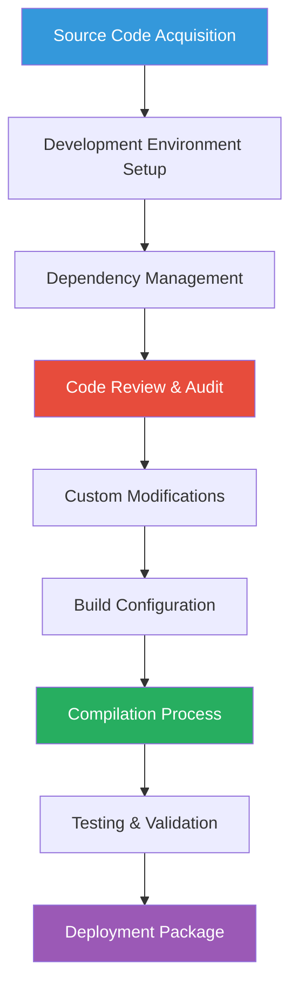
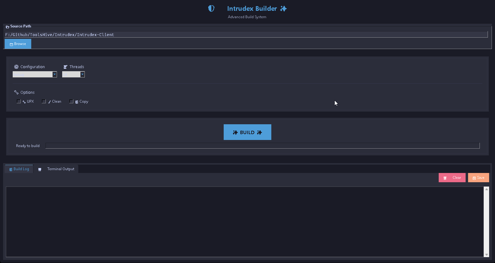

# Source Compilation

This guide provides comprehensive instructions for compiling the Intrudex Client from source code, enabling organizations to perform security audits, implement custom modifications, and maintain complete control over their security monitoring infrastructure.

---

## Source Compilation Overview

!!! info "Source Compilation Benefits"
    Building from source provides complete transparency, enables security auditing, allows custom modifications, and ensures compliance with organizational security policies that require source code review.

### Compilation Benefits

- **Complete Source Transparency**: Full access to all source code
- **Security Auditing**: Comprehensive code review capabilities
- **Custom Modifications**: Implement organization-specific features
- **Compliance Requirements**: Meet regulatory source code requirements
- **Build Reproducibility**: Consistent, verifiable builds
- **Advanced Debugging**: Full debugging symbol support



---

## Development Environment Requirements

### System Requirements

#### Minimum Development Specifications
- **Operating System**: Windows 10 (Build 1909+) / Windows Server 2019+
- **Memory**: 8 GB RAM minimum (16+ GB recommended for large builds)
- **Storage**: 20 GB available space for development environment
- **Network**: High-speed internet for dependency downloads

#### Required Development Tools
- **Visual Studio 2022**: Community, Professional, or Enterprise edition
- **Windows 10/11 SDK**: Latest version (22H2 or later)
- **Git**: Version 2.30 or later
- **CMake**: Version 3.20 or later
- **vcpkg**: Microsoft's C++ package manager

### Development Tool Installation

```powershell
# Install Chocolatey (if not already installed)
Set-ExecutionPolicy Bypass -Scope Process -Force
[System.Net.ServicePointManager]::SecurityProtocol = [System.Net.ServicePointManager]::SecurityProtocol -bor 3072
iex ((New-Object System.Net.WebClient).DownloadString('https://chocolatey.org/install.ps1'))

# Install development tools via Chocolatey
choco install visualstudio2022community -y
choco install windows-sdk-10-version-2004-all -y
choco install git -y
choco install cmake -y
choco install vcpkg -y

# Verify installations
git --version
cmake --version
```

### Visual Studio Configuration

Configure Visual Studio for C++ development:

```powershell
# Install required Visual Studio workloads
$VSInstaller = "${env:ProgramFiles(x86)}\Microsoft Visual Studio\Installer\vs_installer.exe"

& $VSInstaller modify --installPath "${env:ProgramFiles}\Microsoft Visual Studio\2022\Community" `
    --add Microsoft.VisualStudio.Workload.NativeDesktop `
    --add Microsoft.VisualStudio.Workload.MSBuildTools `
    --add Microsoft.VisualStudio.Component.VC.Tools.x86.x64 `
    --add Microsoft.VisualStudio.Component.VC.CMake.Project `
    --add Microsoft.VisualStudio.Component.VC.ATL `
    --add Microsoft.VisualStudio.Component.VC.ATLMFC `
    --add Microsoft.VisualStudio.Component.Windows10SDK.19041 `
    --quiet --wait
```

---

## Source Code Acquisition

### Repository Cloning

Clone the Intrudex repository and navigate to the client source:

```bash
# Clone the main repository
git clone https://github.com/ToolsHive/Intrudex.git
cd Intrudex

# Navigate to client source directory
cd Intrudex-Client

# Verify source structure
ls -la
```

### Source Code Structure

Understanding the client source code organization:

```
Intrudex-Client/
├── assets/                       # External binaries/tools (Sysmon, utilities)
│   ├── IntrudexSigma.mc          # Sigma rule file for detection
│   ├── mc.exe                    # Memory capture/analysis tool
│   ├── snoretoast.exe            # Windows notification utility
│   ├── Sysmon64a.exe             # Sysmon (64-bit, alternate version)
│   ├── Sysmon64.exe              # Sysmon (64-bit, primary)
│   └── Sysmon.exe                # Sysmon (32-bit)
│
├── CMakeLists.txt                # CMake build configuration
│
├── config/                       # Configuration files
│   ├── client_config.json        # Client-specific settings (API endpoints, etc.)
│   ├── sigma_config.json         # Sigma rule definitions for detection
│   └── sysmonconfig-export.xml   # Sysmon configuration (event filtering)
│
├── header/                       # C++ header files (.h)
│   ├── ApplicationHttpSender.h   # HTTP sender for application logs
│   ├── ApplicationLogCollector.h # Application event collector
│   ├── HttpClient.h              # Base HTTP client logic
│   ├── SecurityHttpSender.h      # HTTP sender for security logs
│   ├── SecurityLogCollector.h    # Security event collector (e.g., Sysmon)
│   ├── SigmaEventLogInstaller.h  # Sigma rule installer (Windows Event Log)
│   ├── SigmaLogCollector.h       # Sigma rule-based log collector
│   ├── SigmaManager.h            # Sigma rule management/processing
│   ├── SysmonCollector.h         # Sysmon log collector
│   ├── sysmon_manager.h          # Sysmon service control (start/stop)
│   ├── SystemHttpSender.h        # HTTP sender for system logs
│   ├── SystemLogCollector.h      # System event collector
│   └── utils.h                   # Utility functions (logging, parsing)
│
├── includes/                     # Third-party library headers
│   ├── cxxopts.hpp               # CLI argument parser
│   ├── json.hpp                  # JSON parsing (nlohmann/json)
│   ├── pugiconfig.hpp            # XML parser config (pugixml)
│   ├── pugixml.cpp               # XML parser implementation
│   └── pugixml.hpp               # XML parser header
│
├── src/                          # Main application source code (.cpp)
│   ├── ApplicationHttpSender.cpp   # Impl. for application log HTTP sending
│   ├── ApplicationLogCollector.cpp # Impl. for application event collection
│   ├── HttpClient.cpp             # Base HTTP client logic
│   ├── main.cpp                   # Entry point
│   ├── SecurityHttpSender.cpp      # Impl. for security log HTTP sending
│   ├── SecurityLogCollector.cpp    # Impl. for security event collection
│   ├── SigmaEventLogInstaller.cpp  # Sigma rule installer logic
│   ├── SigmaLogCollector.cpp       # Sigma rule-based log collection
│   ├── SigmaManager.cpp            # Sigma rule management
│   ├── SysmonCollector.cpp         # Sysmon log collection logic
│   ├── sysmon_manager.cpp          # Sysmon service control
│   ├── SystemHttpSender.cpp        # Impl. for system log HTTP sending
│   ├── SystemLogCollector.cpp      # Impl. for system event collection
│   └── utils.cpp                   # Utility functions
│
└── version.rc                    # Windows version resource (metadata)
```

---

### Enterprise Build Procedures

For organizations requiring comprehensive source code auditing and custom enterprise modifications:

**Enterprise Prerequisites**:
- [Microsoft Visual Studio 2019/2022](https://visualstudio.microsoft.com/) or [Build Tools for Visual Studio](https://visualstudio.microsoft.com/downloads/#build-tools-for-visual-studio-2022)
- [CMake 3.15 or later](https://cmake.org/download/)
- [Git Version Control System](https://git-scm.com/download/win)
- Windows Software Development Kit (SDK)

**Enterprise Build Steps**:

1. Navigate to the client development directory:
```bash
cd Intrudex-Client
```

2. Configure the enterprise build environment:
```bash
mkdir build-files
```

3. Compile the enterprise project:
```bash
cmake --build build-files --target Intrudex_Client -j 3
```

**Alternative Enterprise Build Method**: Utilize the automated enterprise build script:
```bash
python builder/Client/Intrudex-Client-Builder.py
```



---

## Code Security Review

### Static Analysis

Perform static code analysis:

```powershell
# Install PVS-Studio (commercial static analyzer)
choco install pvs-studio -y

# Run PVS-Studio analysis
$PVSStudio = "${env:ProgramFiles(x86)}\PVS-Studio\PVS-Studio_Cmd.exe"
& $PVSStudio --target "build\IntrudexClient.sln" --configuration Release --platform x64 --output "analysis-report.plog"

# Generate HTML report
$PlogConverter = "${env:ProgramFiles(x86)}\PVS-Studio\PlogConverter.exe"
& $PlogConverter "analysis-report.plog" --renderTypes html --output "analysis-report.html"
```

### Security Vulnerability Scanning

Scan for known vulnerabilities:

```powershell
# Install dependency check tool
Invoke-WebRequest -Uri "https://github.com/jeremylong/DependencyCheck/releases/download/v7.4.4/dependency-check-7.4.4-release.zip" -OutFile "dependency-check.zip"
Expand-Archive -Path "dependency-check.zip" -DestinationPath "tools"

# Run dependency vulnerability scan
.\tools\dependency-check\bin\dependency-check.bat --project "IntrudexClient" --scan "build" --format ALL --out "security-report"

# Review security report
Start-Process "security-report\dependency-check-report.html"
```

---
