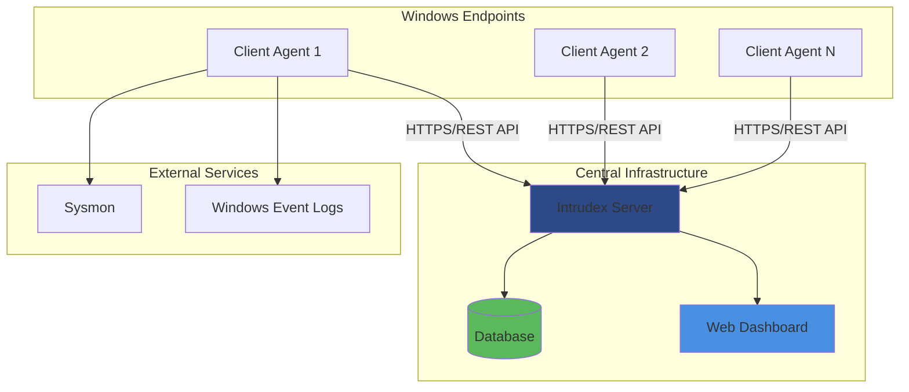
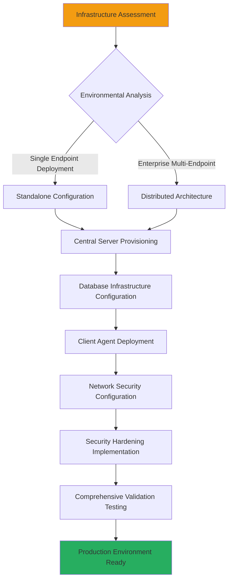

# Intrudex Enterprise Installation Overview

This comprehensive installation guide provides enterprise-grade deployment procedures for the Intrudex security monitoring platform across multiple environments and configurations.

---

## Enterprise Architecture Overview

Intrudex functions as a distributed security monitoring ecosystem comprising two core architectural components:

- **[Intrudex Client](client/)**: High-performance C++ endpoint security agent engineered for Windows environments
- **[Intrudex Server](server/)**: Enterprise-grade Python Flask-based centralized management platform



---

## Enterprise Deployment Strategy



---

## Installation Roadmap

### Phase 1: Server Infrastructure Deployment

Choose your server deployment strategy based on your environment:

=== "Development Environment"
    Perfect for testing, development, and proof-of-concept deployments.
    
    **[Development Server Setup →](server/development.md)**
    
    - SQLite database
    - Development server
    - Local testing
    - Quick setup

=== "Production Environment"
    Enterprise-ready deployment for production workloads.
    
    **[Production Server Setup →](server/production.md)** - Enterprise deployment guide
    
    - PostgreSQL database
    - Production optimizations
    - Security hardening
    - Service deployment

=== "Docker Development"
    Containerized development environment for consistent deployments.
    
    **[Docker Development Setup →](server/docker-dev.md)** - Container development guide
    
    - Docker
    - Development containers
    - Volume mapping
    - Easy cleanup

=== "Docker Production"
    Enterprise containerized deployment with orchestration support.
    
    **[Docker Production Setup →](server/docker-prod.md)** - Enterprise container deployment
    
    - Docker Compose
    - Production containers
    - Security optimization

### Phase 2: Client Agent Deployment

Deploy security agents across your Windows infrastructure:

**[Client Installation Guide →](client/)**

- **[Automated Installer](client/windows-installer.md)**: Recommended for enterprise deployment
- **[Portable Deployment](client/windows-portable.md)**: Custom installation paths (Coming Soon)
- **[Source Compilation](client/windows-source.md)**: Advanced customization (Coming Soon)

---

## Prerequisites Overview

### General Requirements

Before beginning installation, ensure the following prerequisites are met:

#### Network Infrastructure
- **Connectivity**: HTTPS connectivity between clients and server
- **Firewall**: Proper firewall rules configured
- **DNS**: Name resolution functioning correctly
- **Certificates**: TLS certificates for production deployments

#### Security Requirements
- **Administrative Access**: Required for service installation
- **Antivirus Exclusions**: Configure exclusions for Intrudex components
- **Group Policy**: Enterprise deployment considerations
- **Certificate Validation**: PKI infrastructure for certificate management

---

## Quick Start Guide

For rapid deployment testing, follow this streamlined approach:

1. **[Server Development Setup](server/development.md)** (15 minutes)
   ```bash
   git clone https://github.com/ToolsHive/Intrudex.git
   cd Intrudex/Intrudex-Server
   pip install -r requirements.txt
   npm install
   npm run build
   flask db init
   flask db migrate -m "Initial migration"
   flask db upgrade
   ```

2. **[Client Installation](client/windows-installer.md)** (5 minutes)
   ```bash
   # Download and run installer
   Intrudex-Client-Setup.exe
   ```

3. **Validation** (2 minutes)
   ```bash
   curl -k https://localhost:80/login
   ```

---

## Next Steps

Choose your installation path:

<div class="grid cards" markdown>

-   :fontawesome-brands-windows:{ .lg .middle } **Windows Client**

    ---

    Deploy security agents on Windows endpoints

    **[Start Client Installation →](client/)**

-   :fontawesome-solid-server:{ .lg .middle } **Development Server**

    ---

    Set up development environment quickly

    **[Start Development Setup →](server/development.md)**

-   :fontawesome-solid-industry:{ .lg .middle } **Production Server**

    ---

    Deploy enterprise production environment

    **[Production Setup Guide →](server/production.md)**

-   :fontawesome-brands-docker:{ .lg .middle } **Docker Deployment**

    ---

    Containerized deployment options

    **[Docker Deployment Guides →](server/docker-dev.md)**

</div>
