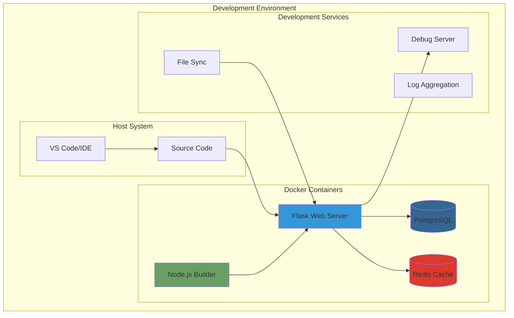

# Docker Development Environment

This guide provides instructions for setting up the Intrudex Server development environment using Docker containers. This approach ensures consistency across development teams and simplifies dependency management.

---

## Docker Development Overview

!!! info "Development Features"
    The Docker development environment provides hot reload, debugging capabilities, isolated database, and volume mounting for real-time code changes without rebuilding containers.

### Development Stack

- **Docker Compose**: Multi-container orchestration
- **Hot Reload**: Automatic application restart on code changes
- **Debug Support**: Remote debugging capabilities
- **Volume Mounting**: Real-time code synchronization
- **Database Isolation**: Containerized PostgreSQL/SQLite
- **Redis Integration**: Caching and session storage



---

## Docker Images

### Available Images

Choose from the following pre-built images or build from source:

=== "Docker Hub (Recommended)"
    ```bash
    # Development image with debugging tools
    docker pull armoghan/intrudex-server:1.0.0-dev
    
    # Production-optimized image
    docker pull armoghan/intrudex-server:1.0.0-prod
    ```

=== "GitHub Container Registry"
    ```bash
    # Development image
    docker pull ghcr.io/toolshive/intrudex:1.0.0-dev
    
    # Production image  
    docker pull ghcr.io/toolshive/intrudex:1.0.0-prod
    
    # Authentication required for private repositories
    echo $GITHUB_TOKEN | docker login ghcr.io -u USERNAME --password-stdin
    ```

=== "Build from Source"
    ```bash
    # Build development image locally
    docker build -f Dockerfile -t intrudex-dev ./Intrudex-Server
    ```

---

## Prerequisites

### Required Software

=== "Windows"
    ```powershell
    # Install Docker Desktop
    winget install Docker.DockerDesktop
    
    # Install Git
    winget install Git.Git
    
    # Install VS Code (optional)
    winget install Microsoft.VisualStudioCode
    
    # Restart after installation
    ```

=== "macOS"
    ```bash
    # Install Docker Desktop
    brew install --cask docker
    
    # Install Git
    brew install git
    
    # Install VS Code (optional)
    brew install --cask visual-studio-code
    ```

=== "Ubuntu/Debian"
    ```bash
    # Update package index
    sudo apt update
    
    # Install Docker
    curl -fsSL https://get.docker.com -o get-docker.sh
    sudo sh get-docker.sh
    
    # Install Docker Compose
    sudo apt install docker-compose-plugin
    
    # Add user to docker group
    sudo usermod -aG docker $USER
    newgrp docker
    
    # Install Git
    sudo apt install git
    ```

### System Requirements

- **Docker Desktop**: Latest version with Docker Compose v2
- **Memory**: 8 GB RAM minimum (containers will use ~2-4 GB)
- **Storage**: 10 GB free space for images and volumes
- **Network**: Internet access for image pulls


## Running the Development Container

Follow these steps to start the Intrudex Server development environment using Docker:

1. **Clone the Repository**
  ```bash
  git clone https://github.com/ToolsHive/Intrudex.git
  cd Intrudex
  ```

2. **Copy Environment Files (if needed)**
  ```bash
  cp .env.example .env
  # Edit .env as required for your setup
  ```

3. **Build the Development Image**
  ```bash
  docker build -f Dockerfile -t intrudex-dev ./Intrudex-Server
  ```

4. **Start the Container**
  ```bash
  docker run --rm -it \
    -p 8000:8000 \
    -v $(pwd)/Intrudex-Server:/app \
    --env-file .env \
    intrudex-dev
  ```

  - Hot reload and debugging are enabled by default in the development image.
  - Adjust volume and port mappings as needed for your environment.

5. **Access the Application**
  - Web server: [http://localhost:8000](http://localhost:8000)
  - API docs: [http://localhost:8000/docs](http://localhost:8000/docs)
  - Database (PostgreSQL): `localhost:5432` (if running separately)
  - Redis: `localhost:6379` (if running separately)

6. **Stopping the Container**
  - Press `Ctrl+C` in the terminal running the container.

!!! tip "Troubleshooting"
  If you encounter permission issues with mounted volumes, ensure your user has the correct permissions or try running Docker as administrator/root.

---
